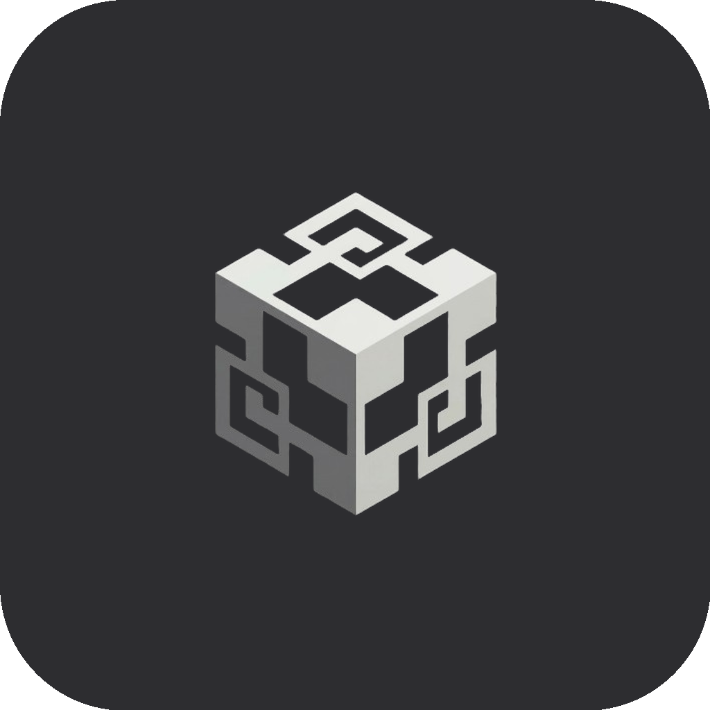

<p align="center">
  
</p>

<h1 align="center">HELM</h1>

<p align="center">
  <strong>AI-powered terminal that teaches as you go.</strong><br/>
  Powered by LANA AI | Built by RedRooster Technologies Inc.
</p>

---

## What is HELM?

HELM is Cursor for the terminal. It wraps a real shell with an AI chat panel that can explain commands, suggest solutions, and inject commands directly into your terminal — all from a single interface.

- **AI Chat** — Ask questions, get answers with runnable code blocks
- **Command Explanation** — Click any command in history to get a full breakdown
- **Multi-Tab Terminals** — Up to 7 tabs with memory tracking and auto-descriptions
- **Works with OpenAI or Anthropic** — Bring your own API key (local AI coming soon)
- **Dark + Light Themes** — Clean, minimal UI

---

## Quick Start

### Prerequisites

- Node.js 18+
- PostgreSQL (`brew install postgresql@16`)

### Install & Run

```bash
npm install
npm run setup:db
npm run dev
```

The app opens with a terminal, address bar, and optional chat + history panels.

### Set Your API Key

Click the settings gear in the tab bar, select your AI provider (OpenAI or Anthropic), paste your API key, and save.

---

## Architecture

```
Tab Bar:  [Terminal 1] [Terminal 2] [+]  |  [Chat] [Sidebar] [Settings]
Address:  [folder icon]  ~/path/to/dir                            [Go]
Layout:   [Chat Panel]  [Terminal (xterm.js)]  [History/Explain Sidebar]
```

- **Electron** + **React** + **TypeScript** + **Vite**
- **xterm.js** + **node-pty** for real shell integration
- **PostgreSQL** for command history, bookmarks, lessons
- **OpenAI / Anthropic** APIs for AI features (swappable)

---

## Scripts

```bash
npm run dev          # Start in development mode
npm run build        # Build for production
npm run package      # Package as macOS .dmg
npm run setup:db     # Create PostgreSQL database
```

---

## Roadmap

See [ROADMAP.md](./ROADMAP.md) for the full product roadmap, including local AI (llama.cpp), learning features, and monetization plans.

---

## License

MIT

---

**HELM** — Powered by LANA AI
Copyright 2026 RedRooster Technologies Inc.
